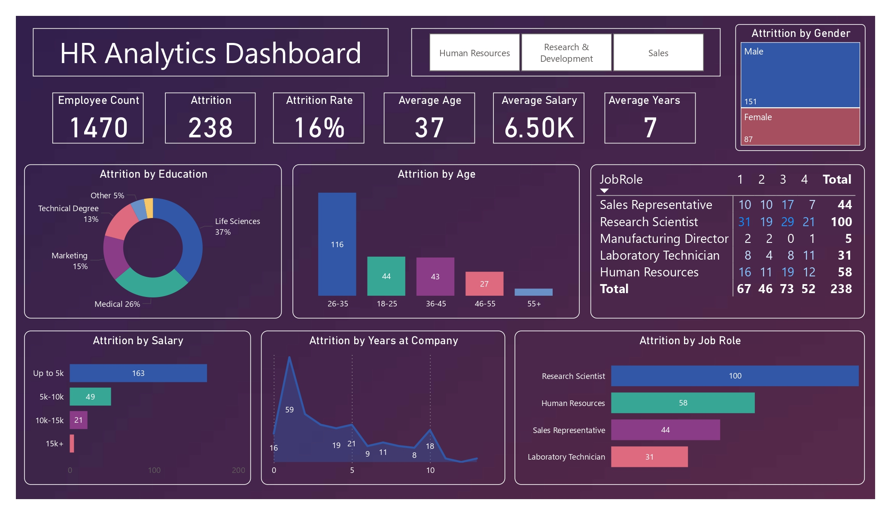

# 📊 HR Analytics Dashboard (Power BI)

## 🔍 Overview
This project showcases an **HR Analytics Dashboard** built in **Power BI** to analyze employee attrition and uncover key workforce insights. The goal is to support data-driven HR decisions by identifying patterns in employee turnover.

---

## ⚙️ Data Preparation
- Cleaned and transformed raw HR data using **Power Query**
- Handled missing values and standardized column formats  
- Created grouped categories:
  - Salary bands (*≤5k, 5k–10k, etc.*)
  - Age groups (*18–25, 26–35, etc.*)

---

## 📈 Key Metrics (DAX)
- **Employee Count:** 1470  
- **Attrition Count:** 238  
- **Attrition Rate:** 16%  
- **Average Age:** 37  
- **Average Salary:** 6.5K  
- **Average Years at Company:** 7  

---

## 📊 Dashboard Features

### 🧑‍🤝‍🧑 Demographic Insights
- Attrition by **Gender**
- Attrition by **Education**
- Attrition by **Age Group**

### 💼 Job & Salary Analysis
- Attrition by **Job Role**
- Attrition by **Salary Bands**
- Job Role breakdown matrix

### ⏳ Employee Behavior
- Attrition by **Years at Company**
- Department-level filtering (HR, R&D, Sales)

---

## 💡 Key Insights
- Highest attrition occurs in the **26–35 age group**
- Employees earning **≤5k salary** have the highest turnover
- Most attrition happens within the **first 2 years**
- **Research Scientists** show the highest attrition among roles

---

## 🛠️ Tools Used
- Power BI  
- Power Query (ETL)  
- DAX (Data Analysis Expressions)

---

## 🚀 How to Use
1. Open the `.pbix` file in Power BI Desktop  
2. Use filters to explore attrition trends  
3. Interact with visuals for deeper insights  

---

## 📌 Project Value
This project demonstrates:
- Data cleaning and transformation  
- KPI creation using DAX  
- Dashboard design and storytelling  
- Business-focused insight generation  

---

## 👤 Author
**Xavier Veloso**  
- 🌐 Portfolio: https://xlavel.github.io/XavierVeloso.github.io/  
- 💼 LinkedIn: https://www.linkedin.com/in/xavierveloso/  
- 💻 GitHub: https://github.com/XLAVel  
